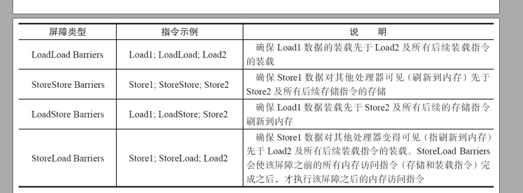
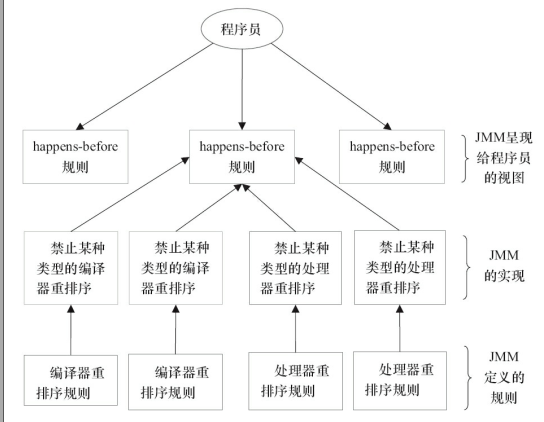

1. 如何减少上下文切换:
    1. 无锁并发编程:
    2. CAS算法:
    3. 使用最少线程:避免创建不必要的线程,比如任务很少,但是创建了很多线程来处理.这样会造成大量线程都处在等待状态
    4. 使用协成:在单线程里实现多任务的调度,并在单线程里维持多个任务间的切换
2. 死锁,详见DEAD-LOCK
   锁: 无锁状态->偏向锁->轻量级锁->重量级锁
3. volatile
   保证此变量对所有的线程的可见性;禁止指令重排序优化
   从汇编角度上看:
   volatile Singleton instance = new Singleton()转成汇编语言后,会加上一条lock 开头的指令.该指令实现了2个功能:<1> 将当前处理器缓存行的数据协会到系统内存.<2> 这个歇会内存的操作会使在其他CPU里缓存了该内存地址的数据无效.
   1> 实现原则:
        1.Lock前缀指令会引起处理器缓存写回到内存.
        2.一个处理器的缓存回写到内存会导致其他处理器的缓存无效.
   2> 内存语义及实现方式
        通过 内存屏障 来实现
4. 原子操作:
   处理器通过两种手段实现原子操作:
   1> 使用总线锁:当一个处理器在总线上输出LOCK信号时,其他处理器的请求将被阻塞住,那么该处理器可以独占共享内存.
   2> 使用缓存锁:只需要保证某个内存地址的操作是原子性的即可.这种办法比总线索的开销要小.
5. CAS:
   1> 缺点:ABA问题,使用AtomicStampedReferencef
          循环时间长,开销大
          只能保证一个共享变量的原子操作
6. 重排序
   重排序是指编译器和处理器为了优化程序性能而对指令序列进行重新排序的一种手段.
   重排序分为3种:  
   >> 1> 编译器优化的重排序.编译器在不改变单线程程序语义的前提下.可以重新安排语句的执行顺序.  
   >> 2> 指令级并行的重排序.现代处理器采用了指令级并行技术来将多条指令重叠执行.如果不存在数据依赖性.处理器可以改变语句对应机器指令的执行顺序.  
   >> 3> 内存系统的重排序,由于处理器使用缓存和读/写缓冲区.这是得加载和存储操作看上去可能是在乱序执行.  
   
   从java源码到最终实际执行的指令序列,分别会经历如下3种重排序:  
   >> 源代码 -> 编译器优化重排序 [编译器重排序] -> 指令级并行重排序 [处理器重排序] -> 内存系统重排序 [处理器重排序] -> 最终执行的指令序列  
   编译器和处理器可能会对操作做重排序,编译器和处理器在重排序时,会遵守数据依赖性,编译器和处理器不会改变存在数据依赖关系的2个操作的执行顺序.这里所说的依赖性仅针对单个处理器中执行的指令序列和单个线程中执行的操作,不同处理器之间和不同线程之间的数据依赖性不被编译器和处理器考虑
   这些重排序可能会导致多线程程序出现内存可见性问题.  
   1> 对于编译器,JMM[java内存模型]的编译器重排序规则会进制特定类型的编译器重排序(不是所有的编译器重排序都要禁止).  
   2> 对于处理器重排序,JMM的处理器重排序规则会要求JAVA编译器在生成指令序列时,插入特定类型的内存屏障指令,通过内存屏障指令来禁止特定类型的处理器重排序.  
   JMM通过禁止特定类型的编译器重排序和处理器重排序,为程序员提供一致的内存可见性保证  
   java内存屏障类型如下表:  
     
   StoreLoad Barriers是一个全能型的屏障,他问同时具有其他3个屏障的效果.现代的多处理器大多支持该屏障(其他类型的屏障不一定被所有的处理器支持).执行该屏障开销会很高.因为当前处理器通常要把写缓冲去中的数据全部刷新到内存中.  
7. happens-before(针对多线程)
   定义: 如果一个操作执行的结果需要对另一个操作可见,那么这两个操作之间必须要存在happens-before原则．这两个操作可以是同一个线程或者多线程．
   原则：
   1. 程序顺序规则: 一个线程中的每个操作,happens-before 于该线程中的任意后续操作.
   2. 监视器锁规则: 对一个锁的解锁,happens-before 于随后这个锁的加锁
   3. volatile变量规则:对一个volatile域的写,happens-before于任意后续对这个volatile域的读
   4. 传递性 如果A happends-before B,B happends-before C, 则A happends-before  
   两个操作之间具有happens-before 关系,并不意味着前一个操作必须要在后一个操作之前执行.happens-before仅仅要求前一个操作(执行的结果)对后一个操作可见,且前一个操作按顺序排在第二个操作之前.  
   happens-before与JMM的关系如下:
   
8. as-if-serial语义(针对单线程)  
   as-if-serial语义: 不管怎么重排序,程序的执行结果不能被改变.编译器,runtime和处理器都必须遵守as-if-serial语义.         
   为了遵守as-if-serial语义,编译器和处理器不会对存在数据依赖关系的操作做重排序.

